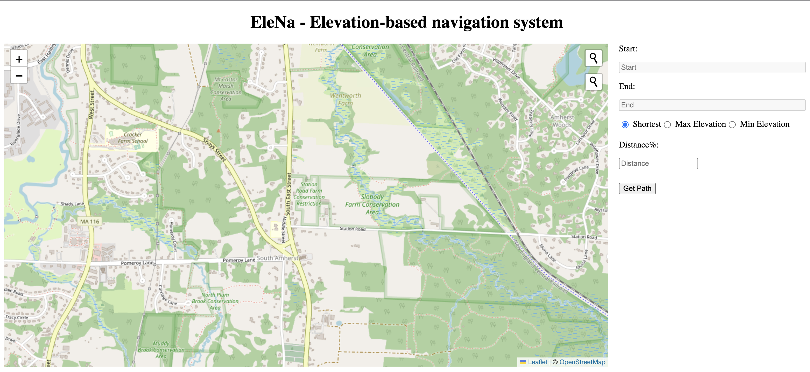
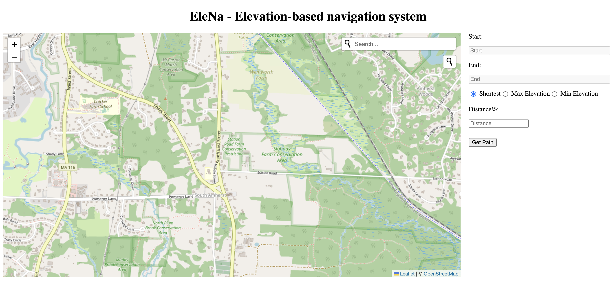
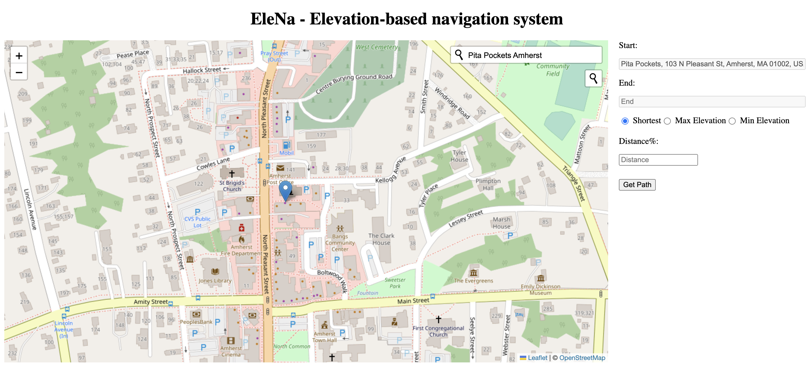
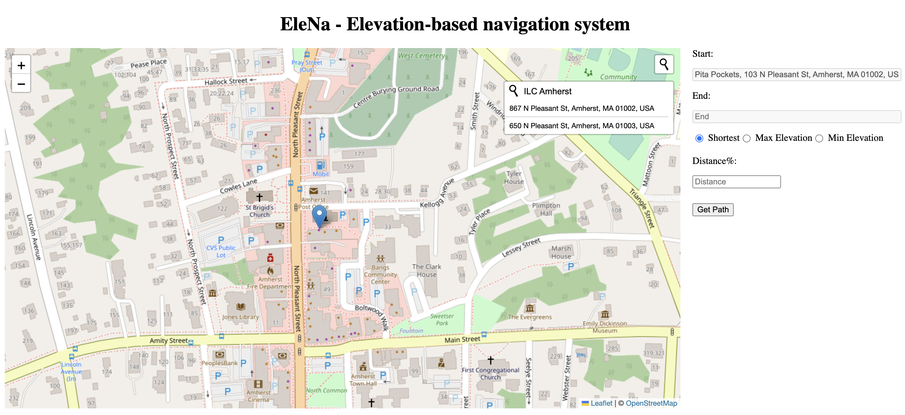
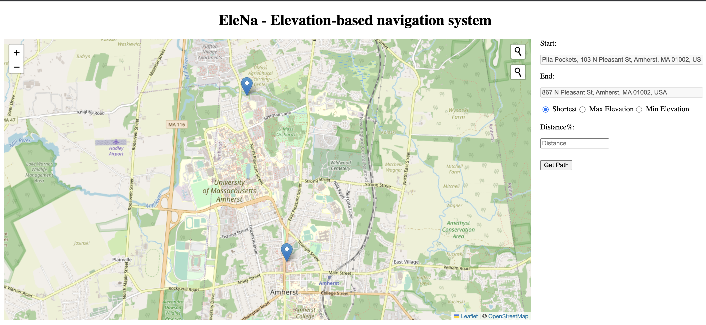
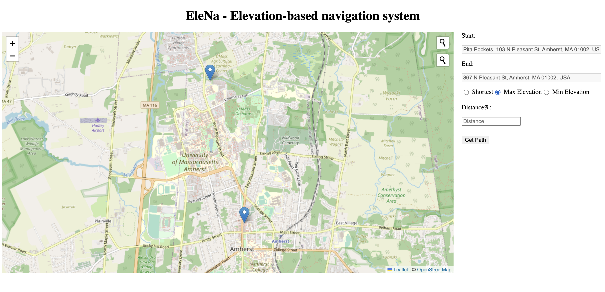
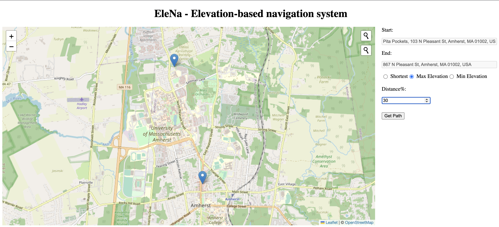
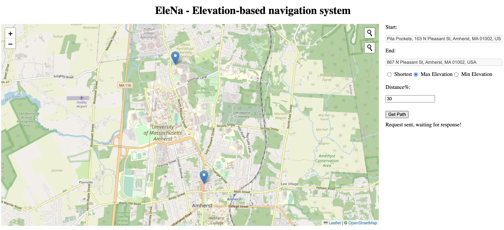
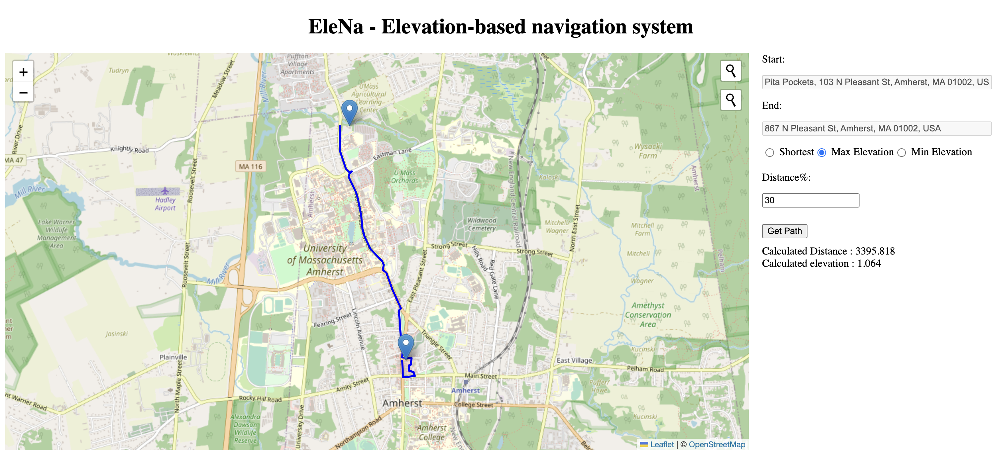
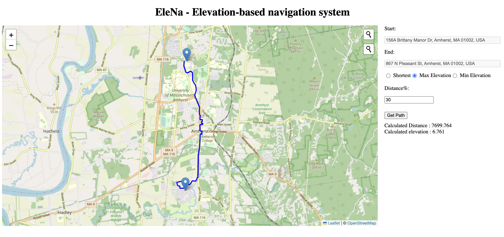

## Team - SDECorps
## 520 Course Project - ELeNa
The project is about implementing a navigation system that considers the elevation gain. A typical system like Apple or Google Maps just takes the start and end points from the user and presents the shortest distance between them using standard algorithms such as Dijkstra’s or A*.  The goal of this project is to develop a software system that determines a route to minimize/maximize the elevation gain depending on the start and end locations of the user. The elevation gain increment/decrement can change the distance to up to x% of the original shortest route. 

For the purposes of this project, we have used 'drive' as the mode of transport to load the graph using OSMnx.
 

### 1. Install requirements for running the application
##### `pip install -r requirements.txt`

### 2. Start the backend server
#### Navigate to backend/controller and run the following command
##### `python server.py`

### 3. In order to perform integration testing of backend and unit testing of backend
#### Navigate to backend/tests, run following command
##### `pytest`

### 5. To use the application, navigate to frontend/view/
##### Open the front_end_body.html in browser
##### Start using the application!

 
 

### The user can interact with the application in the following way
 

#### 1. The start screen of the application looks as follows
#### 
 

#### 2. Using the top magnifying glass, the user can enter the source location
#### 
 

#### 3. After typing the source location, they hit enter and the location will be visible in the text box on the right side
#### 
 

#### 4. Similarly, using the bottom magnifying glass, the user can enter the target location. Suggestions for the location will be visible, out of which user can select one
#### 
 

#### 5.By default, the option for shortest path is selected
#### 
 

#### 6. User can select appropriate option for elevation
#### 
 

#### 7. User can enter the desired distance percentage. Default value is 0.
#### 
 

#### 8. Upon clicking the 'Get Path' button, a message is displayed indicating that response is yet to be recieved
#### 
 

#### 9. Upon receiving the response, path is displayed on the map and total distance and elevation is displayed along the path
#### 
 

#### 10. A different source/target location can be selected and using the appropriate options, the path for the same will be retrieved
#### 
 

#### 11. If the user enters source/target locations from different cities, the corresponding error message will be displayed
#### 
 